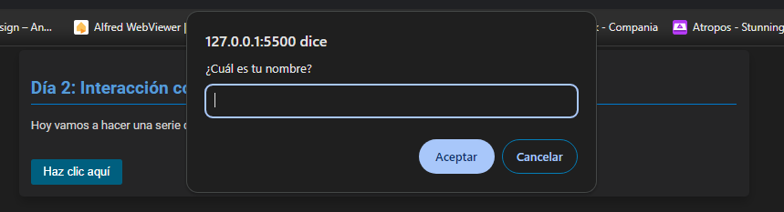

# #7DaysOfCode

Este es un proyecto realizado como parte del desafío #7DaysOfCode, en el cual se desarrollaron distintas funcionalidades utilizando HTML, CSS y JavaScript. Cada día corresponde a un nuevo reto que permite mejorar habilidades en desarrollo web.

## Descripción

La aplicación creada es una página web que muestra los retos completados durante los 7 días del desafío. La aplicación incluye lógica de JavaScript para resolver problemas y hacer la página interactiva para los usuarios.

## Tecnologías Utilizadas

- **HTML5**: Estructura del contenido.
- **CSS3**: Estilos visuales y diseño responsive.
- **JavaScript**: Lógica e interactividad del usuario.

## Funcionalidades

### Día 1

- Se implementó una serie de condiciones utilizando operadores de comparación en JavaScript para comparar valores y tipos de variables.
  
### Día 2

- Se desarrolló una funcionalidad interactiva que realiza preguntas al usuario, personaliza la experiencia con base en las respuestas, y proporciona mensajes motivacionales.

### Día 3

- Se creó una funcionalidad interactiva donde el usuario puede seleccionar áreas de trabajo y tecnologías, con respuestas personalizadas basadas en la elección del usuario.

### Día 4

- Se implementó un juego de adivinanza de números con efectos visuales de glitter usando `SweetAlert2`. Los usuarios tienen 3 intentos para adivinar el número correcto.

- **(En desarrollo)**: Secciones planeadas para futuros retos, que incluirán funcionalidades adicionales como manejo de arrays, manipulación del DOM, y más.

## Uso

1. Clona el repositorio en tu máquina local:
    ```bash
    git clone https://github.com/MarioDevelop3r/7DaysOfCode.git
    ```

2. Abre el archivo `index.html` en tu navegador para ver la aplicación en acción.

3. Haz clic en el texto del Día 2 para interactuar con la aplicación y ver las funcionalidades implementadas.

## Capturas de Pantalla




## Autor

Desarrollado por [Mario Rojas](https://www.linkedin.com/in/mario-rojas-dev/). Puedes seguir mi trabajo en [GitHub](https://github.com/MarioDevelop3r).

## Contribución

Si deseas contribuir al proyecto, por favor, sigue los siguientes pasos:

1. Haz un fork del repositorio.
2. Crea una nueva rama (`git checkout -b feature/nueva-funcionalidad`).
3. Realiza tus cambios y haz commit (`git commit -m 'Agrega nueva funcionalidad'`).
4. Haz push a la rama (`git push origin feature/nueva-funcionalidad`).
5. Abre un Pull Request.

## Licencia

Este proyecto está bajo la Licencia MIT. Para más detalles, revisa el archivo [LICENSE](LICENSE).

---

¡Gracias por revisar mi proyecto! Si tienes alguna sugerencia o comentario, no dudes en contactarme.